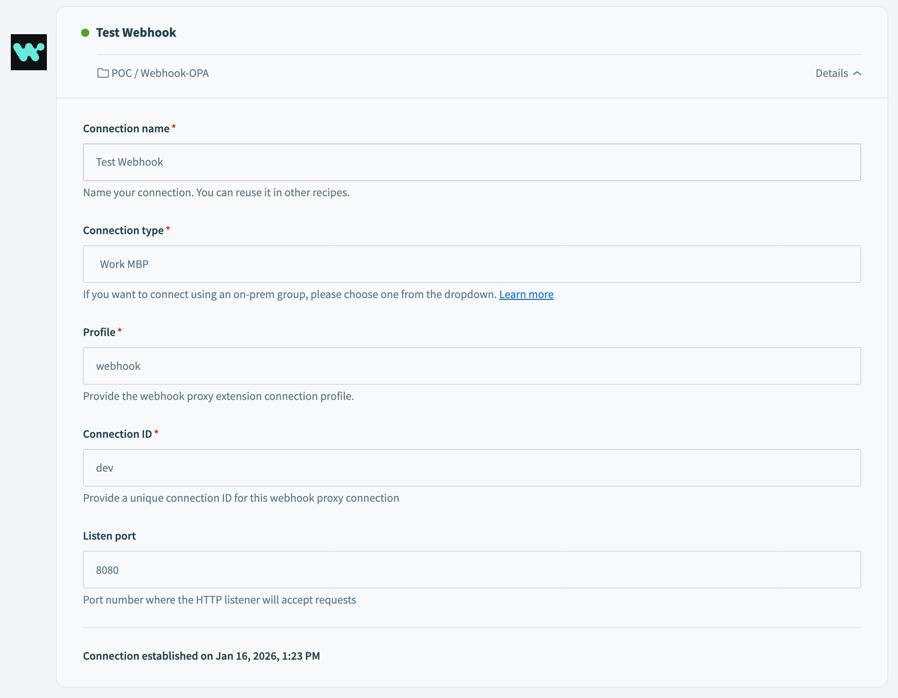

# Workato Webhook Proxy

A simple HTTP reverse proxy service that forwards requests to Workato webhook URLs.

## Overview

This service acts as an intermediary that receives HTTP requests and forwards them to Workato platform webhooks. It's built with Spring Boot and Java 21.

## Features

- ✅ HTTP POST and GET request proxying
- ✅ Header forwarding
- ✅ Health check endpoint
- ✅ Comprehensive logging

## Quick Start

### Prerequisites

- Java 17 or higher
- Maven 3.9+ or Gradle 8.x

### Build

Using Maven:
```bash
cd opa-extension
mvn clean package
```

Using Gradle:
```bash
cd opa-extension
./gradlew clean build
```

## Installation

### 1. Deploy the Extension JAR

After building, copy the JAR file to your Workato OPA's extension library directory:

Using Maven:
```bash
cp opa-extension/target/opa-extension-1.0-SNAPSHOT.jar <OPA_HOME>/lib_ext/
```

Using Gradle:
```bash
cp opa-extension/build/libs/opa-extension-1.0-SNAPSHOT.jar <OPA_HOME>/lib_ext/
```

Replace `<OPA_HOME>` with your Workato OPA installation directory.

### 2. Configure the Extension

Edit your OPA's `conf/config.yml` to register the webhook extension:

```yaml
extensions:
  webhook:
    controllerClass: com.workato.proxy.webhook.WebhookOPAExtension
```

### 3. Restart the OPA

Restart your Workato OPA service to load the extension:

```bash
cd <OPA_HOME>
./bin/stop.sh
./bin/start.sh
```

### 4. Create a Connection in Workato

In your Workato workspace:

1. Navigate to **Connections** and click **Create**
2. Fill in the connection details:
   - **Connection name**: Choose a descriptive name (e.g., "Test Webhook")
   - **Connection type**: Select your OPA group (e.g., "Work MBP")
   - **Profile**: Enter `webhook`
   - **Connection ID**: Enter a unique identifier (e.g., `dev`)
   - **Listen port**: Enter the port for the HTTP listener (e.g., `8080`)
3. Click **Connect**



### 5. Test the Connection

Test the webhook endpoint using curl:

```bash
curl -X POST http://localhost:8080/<connection-id> \
  -H "Content-Type: application/json" \
  -d '{
    "timestamp": 1737025800,
    "order_id": "ORD-234",
    "customer_email": "customer@example.com",
    "amount": 99.99
  }'
```

Replace `<connection-id>` with the Connection ID you specified (e.g., `dev`).